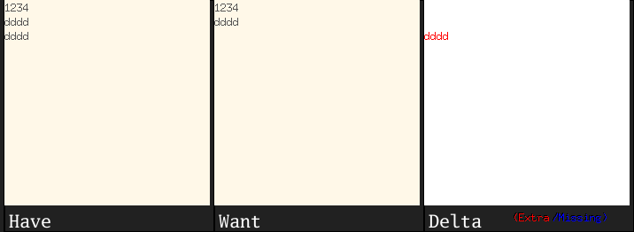

# Etch
Package etch provides a simple facility to write graphical regression tests.
The Assertf function provides the common case functionality. Provide it the
test variable, along the image you have and want, and it will fail your case
if want != have.

Optionally, provide a filename to store the graphical difference as an
uncompressed PNG if the test fails.

The Extra data in the image (have but don't want) is represented in Red. The
Missing data (want, but dont have) is represented in Blue. These can be
changed by modifying Extra and Missing package variables

To simplify the package, the alpha channel is ignored. A color triplet is
equal to another if it's R,G,B values are identical.

The foreground variable, FG, is what to paint on the delta image if two
pixels match The background variable, BG, is the common background color
between two images

If two pixels at the same (x,y) coordinate don't match, the ambiguity is
resolved by comparing the image you have's color value at that coordinate to
the background color. If the color matches, the pixel you have is an extra.
Otherwise, it's missing.

# Example

I observed a bug in A where the text on the last line wasn't
cleaned up unless that last line ended in a newline character. This
means if the frame displayed `^x\ny\nabcd$` and `y\n` is deleted, the
user would see `^x\nabcd\nabcd`. Nasty.

There's no way to programatically check for this defect. Just kidding,
we can programatically check for any defect as long as we know how
to reproduce it. 

# Step 1

Insert the text


# Step 2

Select the region


# Step 3

Delete the region


Great, we know how to do it manually, now let's do it automatically.
If this is second nature to you, I'm not surprised. But the reason
I made this example so elaborate was because I've personally witnessed
a private email thread go on for 4 months on how to do something like
this in c# and c++. The result: no-op. I bet it's still done manually.

Here's the only thing we need to do:

```
	have = image.NewRGBA(r)
	want = image.NewRGBA(r)
```

Now for the test case specific stuff. Your steps will replace mine
below depending on what you're actually doing to the images. The
frame draws on them directly, so we really don't care about
its inner workings too much, just that there's a bug and we're
going to test for its existence using these two images: have
and want.


```
	// Create two frames
	h = New(r, font.NewBasic(fsize), have, A)
	w = New(r, font.NewBasic(fsize), want, A)
	
	// Insert some text with and without trailing newlines
	w.Insert([]byte("1234\ncccc\ndddd\n"), 0)
	h.Insert([]byte("1234\ncccc\ndddd"), 0)
	
	// Delete the second line
	h.Delete(5, 10)
	w.Delete(5, 10)
```

By this point, `want` will be an image with the defect-free
state and `have` will be an image with the defective state

```
	etch.Assertf(t, have, want, "delta.png", "TestDeleteLastLineNoNL: failed")
```


We run `go test`

```
--- FAIL: TestDeleteLastLineNoNL (0.03s)
	etch.go:62: TestDeleteLastLineNoNL: failed
FAIL
exit status 1
FAIL	github.com/as/frame	0.092s
```

We can look at the image to see what went wrong: delta.png



```
	f.Draw(f.b, image.Rect(pt0.X, pt0.Y, pt0.X+(f.r.Max.X-pt1.X), q0), f.b, pt1, f.op)
	f.Draw(f.b, image.Rect(f.r.Min.X, q0, f.r.Max.X, q0+(q2-q1)), f.b, image.Pt(f.r.Min.X, q1), f.op)
	// f.Paint(image.Pt(pt2.X, pt2.Y-(pt1.Y-pt0.Y)), pt2, f.Color.Back)

```

The bug is the commented line above. Once the comment is removed, the test passes. Because `go test`
can be run automatically on file changes, this eliminates the manual step of checking the image. The
test passes once have and want are the same image.

[](https://goreportcard.com/badge/github.com/as/etch)


